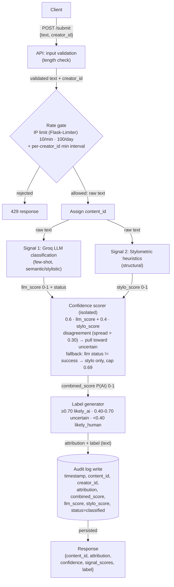
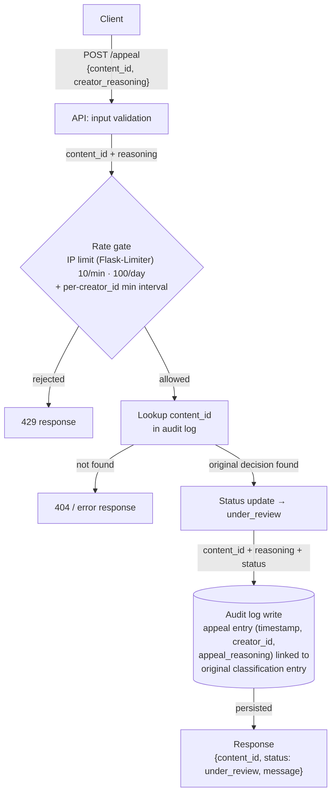

## 1. Detection Signals

**Signal 1 — Groq LLM Classification (semantic/stylistic signal)**

- **What it measures:** A holistic judgment of whether the text *reads* as human- or AI-generated — voice, idea flow, topical coherence, and the overall "feel" of the writing. This is the kind of judgment that resists simple statistics: a sentence can be grammatically unremarkable but still carry an AI "register" (evenly hedged, thesis-driven, low on genuine surprise).

- **How it's produced:** The text is sent to `llama-3.3-70b-versatile` with a few-shot system prompt that gives the model labeled examples of human vs. AI writing, then asks it to return structured JSON:

    ```json
    { "llm_ai_probability": 0.0-1.0, "label": "likely_human|likely_ai|uncertain", "reason": "short rationale" }
    ```

- **Output shape:** A float in `[0, 1]` (`llm_score`), where 1.0 = confidently AI, 0.0 = confidently human. Also carries a `status` field (`success`, `parse_failure`, `schema_violation`, `injection_flagged`) used by the fallback logic.


- **Blind spots:** Not purpose-trained for this task (just prompted); can be confidently wrong; struggles on short text with little context; can flag very clean human writing as AI; can miss AI text that's been hand-edited in places to sound more human.


**Signal 2 — Stylometric Heuristics (structural signal)**

- **What it measures:** The statistical "shape" of the text, independent of meaning — computed entirely in pure Python, no external model:
  - Sentence-length variance / burstiness (std-dev of sentence length and pacing)
  - Vocabulary richness (type-token ratio: unique words / total words)
  - Punctuation density (marks per word/sentence)
  - Average sentence complexity (mean sentence length / clause density)

- **How it's produced:** Each metric is computed directly, normalized to `[0, 1]`, then combined (weighted average) into one `stylo_score`, where 1.0 = highly uniform (AI-leaning) and 0.0 = highly variable/bursty (human-leaning).

- **Output shape:** A float in `[0, 1]`.

- **Blind spots:** Completely content-blind (only looks at structure, never meaning); flags deliberately uniform human writing (academic papers, formal poetry, technical docs) as AI-like; can be fooled by AI text explicitly prompted to be "burstier"; can't detect AI text that a human has since revised.

**Why these two are genuinely distinct:** one is semantic (does this *sound* like AI?), the other is structural (does this *look* like AI, statistically?). Their blind spots don't overlap. An AI-sounding-but-structurally-messy poem and a human-sounding-but-structurally-uniform legal brief would each get flagged by only one signal, which is exactly what makes combining them useful.
 
**Combining into a single confidence score:**

1. If `llm_score.status == "success"`: `combined_score = (0.6 * llm_score) + (0.4 * stylo_score)`. The LLM signal is weighted more heavily because it captures more of what a reader actually experiences as "AI-sounding," but the stylometric signal still meaningfully pulls the score when the two disagree.

2. **Agreement case:** if both scores land on the same side of 0.5 and are within ~0.15 of each other, the combined score is a high-confidence read in that direction.

3. **Disagreement case:** if the two scores are more than ~0.30 apart (one signal says "clearly human," the other says "clearly AI"), the combined score is deliberately pulled toward the 0.40–0.70 band rather than averaged naively — a strong disagreement between two independent signals is itself evidence of uncertainty, not a wash.

4. **Degraded-signal fallback:** if the LLM signal's `status != "success"` (parse failure, schema/range violation, or `injection_flagged`), the scorer drops the LLM score entirely, uses `stylo_score` alone, and caps the result at `min(stylo_score, 0.69)`. This guarantees a single content-blind signal can never push a submission into the "likely AI" band on its own — preserving the false-positive asymmetry even when a component fails. The audit log records the exact failure mode.

---

 
## 2. Uncertainty Representation
 
**What 0.6 means:** `combined_score` is a calibrated `P(AI)` — the system's estimate of the probability the text is AI-generated, not a raw model logit or an arbitrary "match strength." A score of 0.6 means: *the two signals lean toward AI but not strongly enough, or they disagree enough, that the system is not confident either way* — it falls in the "uncertain" band, and the user-facing label reflects that hedge honestly rather than rounding up to an accusation.
 
**Mapping raw outputs to a calibrated score:** Both raw signals are already normalized to `[0, 1]` before combination. Calibration happens at the *combination* step, not the individual signal step: the weighting (0.6/0.4), the disagreement-pulls-toward-uncertain rule, and the fallback cap are what turn two independent noisy signals into one number that behaves consistently — i.e., a 0.51 and a 0.95 must land in genuinely different bands, and a strong disagreement between signals must never accidentally produce a confident-looking score.
 
**Thresholds:**
 
| Combined confidence (P(AI)) | Attribution     | Label variant          |
|---|---|---|
| ≥ 0.70                       | `likely_ai`     | High-confidence AI      |
| 0.40 – 0.70                  | `uncertain`      | Uncertain               |
| < 0.40                       | `likely_human`   | High-confidence human   |
 

The AI threshold is deliberately set high (0.70, not 0.50) and the uncertain band is deliberately wide (a 30-point range) to reflect the false-positive asymmetry: wrongly telling a human creator their work "looks AI-generated" does more relationship damage on a creative platform than an occasional missed AI submission. When in doubt, the system says "we're not sure," not "this is AI."
 
---

## 3. Transparency Label Design
 
All three variants are written in plain language, avoid technical terms ("classifier," "logit," "P(AI)," "signal"), and explicitly acknowledge that the system can be wrong.
 
**High-confidence AI**
> "Our system thinks this was likely generated by AI. This isn't a certainty — it's based on writing patterns our tools detected, and we could be wrong. If this is your original work, you can appeal this result and a person will review it."
 
**Uncertain**
> "We're not confident enough to say whether this was written by a person or by AI. This label just means our tools picked up a mix of signals — it's not a judgment on your work. No action is needed unless you want to appeal for a closer look."
 
**High-confidence human**
> "Our system did not detect signs of AI generation in this piece — it reads as human-written. As with any automated check, this isn't a guarantee, just our best read."
 
Each variant is deliberately hedged (no variant states a result as fact), and each names the possibility of being wrong — the AI variant is the only one paired with an explicit call-to-action (appeal) since it's the one carrying the most reputational weight for the creator.
 
---
 
## 4. Appeals Workflow
 
**Who can appeal:** The original creator of the submission (identified by `creator_id`, matched against the `creator_id` stored on the original audit log entry for that `content_id`). No login/auth system is required for this project, but the endpoint only accepts appeals tied to a valid, existing `content_id`.
 
**What they provide:** `content_id` (which submission they're contesting) and `creator_reasoning` (free-text explanation of why they believe the classification is wrong — e.g., "I wrote this myself; I'm a non-native English speaker and my writing tends to read as more formal/uniform").
 
**What the system does on receipt:**

1. Looks up the original entry by `content_id`; rejects the request if it doesn't exist.

2. Updates that content's `status` field to `"under_review"` in storage.

3. Writes a new structured audit log entry containing: `content_id`, `creator_id`, `appeal_reasoning`, `timestamp`, and a reference back to the original classification entry (original `attribution`, `confidence`, and signal scores) so the two are visible together.

4. Returns a confirmation response: `{ "content_id": ..., "status": "under_review", "message": "Appeal received." }`.

5. No automated re-classification happens — this is intentionally a human-in-the-loop step.

**What a human reviewer would see in the appeal queue:** Every log entry with `status: "under_review"`, each showing side-by-side: the original text (or a reference to it), the original `attribution` + `combined_score` + both individual signal scores, the creator's appeal reasoning, and the timestamps of both the original decision and the appeal — enough context to make a judgment call without re-running the pipeline.
 
---
 
## 5. Anticipated Edge Cases
 
1. **Formal, uniform human writing from non-native English speakers (or academic/technical writers).** Both signals push toward "AI": the stylometric signal reads consistent sentence length and "safe" vocabulary as low-burstiness/high-uniformity, and the LLM signal reads the same evenness as the "thesis-driven, smoothly transitioned" register it associates with AI text. In practice this should land in the `uncertain` band (0.40–0.70) rather than `likely_ai`, thanks to the 0.70 threshold, but it's a scenario where the *combination* of two structurally-similar failure modes could still push a genuine human writer higher than they deserve. This is the scenario that justifies keeping the AI threshold conservative.

2. **Poetry or lyrical prose with heavy repetition and simple, deliberate vocabulary.** The stylometric signal specifically measures vocabulary richness and sentence-length variance — a poem built on intentional repetition (refrains, anaphora) or restricted vocabulary (a choice, not a limitation) will score low on both, which the heuristic reads as "uniform → AI-leaning." The signal has no way to know the uniformity is a deliberate artistic device rather than a symptom of generation.

3. **AI-generated text that has been manually edited afterward.** Both signals were designed around unedited output. A human polishing pass introduces exactly the kind of irregularity (varied sentence length, idiosyncratic word choice) that both signals associate with "human," so heavily-edited AI text will likely score `likely_human` or `uncertain` — a false negative. This is a known, named blind spot for both signals rather than something the system can currently detect; it's called out explicitly in the README's limitations section rather than papered over.

4. **Very short submissions (a paragraph or less).** The LLM signal's blind spot around limited context is most acute here — few-shot prompting works best when there's enough text to establish a "voice." The stylometric signal is also less reliable on small samples (a single unusually long or short sentence swings the variance heavily on a 3-sentence input). Short submissions should be expected to land in `uncertain` more often, not because the writing is ambiguous, but because there isn't enough signal to work with — a limitation worth stating rather than hiding.


---

## Architecture

**Submission flow:** a request passes through rate limiting and gets a `content_id`, then runs through both detection signals independently, gets combined into a single calibrated confidence score, mapped to a transparency label, written to the audit log, and returned to the client.



**Appeal flow:** a request is rate-limited and matched to its original submission, flips that content's status to `under_review`, and is logged alongside the original decision so a human reviewer can see both together.




## AI Tool Plan
 
For each implementation milestone, I'll hand the AI tool the relevant spec sections plus the architecture diagram — not the whole planning.md — so the prompt stays scoped to what that milestone actually needs, and I'll verify the output against the specific thresholds/formats I already defined rather than accepting whatever "looks reasonable."
 
### M3 — Submission endpoint + first signal
 
- **What I'll provide:** The `## Detection Signals` section (Signal 1: Groq LLM classification only, including its output shape and blind spots) and the submission-flow half of the `## Architecture` diagram.

- **What I'll ask for:** (1) A Flask app skeleton with a `POST /submit` route stub that accepts `{text, creator_id}`; (2) the Signal 1 function — a call to `llama-3.3-70b-versatile` with few-shot prompting that returns `{llm_ai_probability, label, reason, status}`.

- **How I'll verify:** Call the signal function directly with a few standalone test inputs before wiring it into the route, and confirm the returned JSON matches the exact shape my spec defines (float in `[0,1]` plus a `status` field — not just a bare score). Then check the Flask route's request/response shape against my API contract (`content_id`, `attribution`, placeholder `confidence`, placeholder `label`) before moving on. I won't paste the AI's output straight in — I'll read it line by line and fix anything that doesn't match the contract.


### M4 — Second signal + confidence scoring
 
- **What I'll provide:** The `## Detection Signals` section (both signals this time, including the stylometric metrics list) and the `## Uncertainty Representation` section (thresholds, the 0.6/0.4 weighting, the disagreement rule, and the LLM-fallback cap), plus the diagram.

- **What I'll ask for:** (1) The Signal 2 function — pure-Python stylometric heuristics (sentence-length variance, type-token ratio, punctuation density, sentence complexity) combined into a single `stylo_score`; (2) the confidence-scoring function that combines `llm_score` and `stylo_score` per my exact formula, including the disagreement rule and the fallback cap.

- **How I'll check:** Run the four deliberately-chosen test inputs from Milestone 4 (clearly AI, clearly human, two borderline cases) and confirm scores vary meaningfully and land in the direction I expect. Specifically verify the generated code matches my spec's numbers — not just "reasonable-looking" weights — by checking: is it really `0.6 * llm + 0.4 * stylo`? Does a >0.30 spread actually get pulled toward the uncertain band instead of just averaged? Does a failed LLM call actually cap the result at 0.69? If any of these silently diverge from what I specified, I'll correct it before wiring it into `/submit`.

### M5 — Production layer
 
- **What I'll provide:** The `## Transparency Label Design` section (all three exact label strings) and the `## Appeals Workflow` section, plus the diagram (specifically the appeal-flow half).

- **What I'll ask for:** (1) A label-generation function that maps `combined_score` to the correct `attribution` + `label` pair using my three threshold bands; (2) the `POST /appeal` endpoint that accepts `{content_id, creator_reasoning}`, updates status, and logs the appeal.

- **How I'll verify:** Submit inputs designed to land in each of the three bands and confirm all three label variants are reachable and that the returned text matches what I wrote word-for-word — not a paraphrase the AI decided sounded better. For the appeal endpoint, use the `content_id` from an earlier `/submit` response, POST an appeal, then hit `GET /log` and confirm the entry shows `"status": "under_review"` with `appeal_reasoning` populated and linked to the original classification entry, before considering it done.

